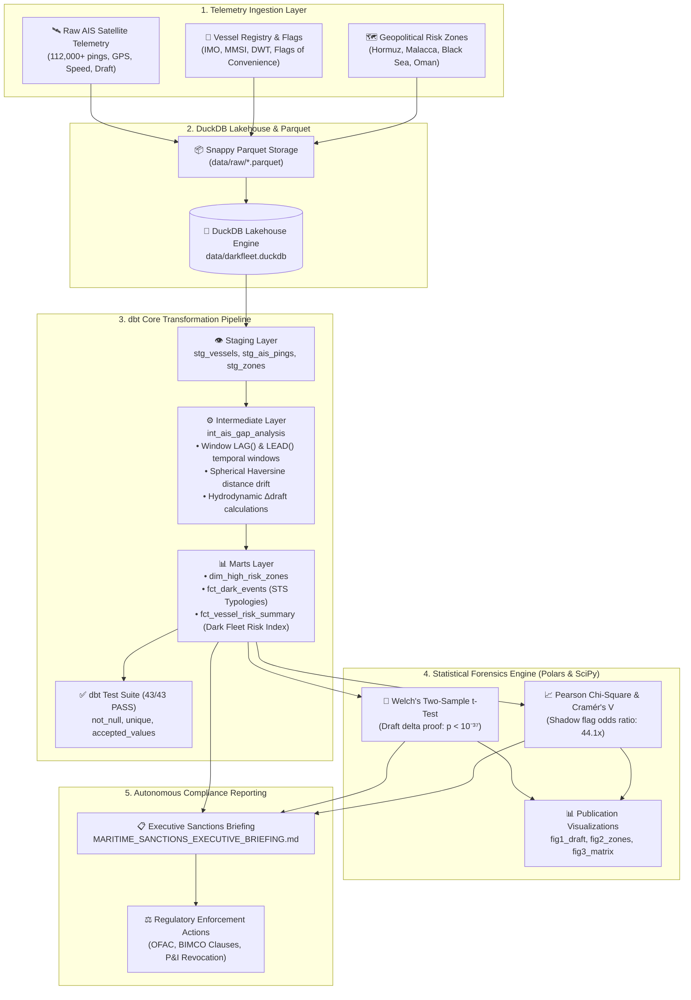

# 🛰️ DarkFleet-IQ: Geopolitical AIS Maritime Satellite Telemetry & Dark-Zone Transponder Forensics

[](https://duckdb.org)
[](https://getdbt.com)
[](app.py)
[](DarkFleet_IQ_Master_Engineering_Guide.pdf)
[](DarkFleet_Forensics_Analysis.ipynb)
[](https://python.org)
[](https://pola.rs)
[](https://scipy.org)
[](https://parquet.apache.org)

> **An institutional-grade maritime surveillance and statistical forensics platform engineered to detect illicit sanctions evasion, transponder tampering (*going dark*), and clandestine mid-sea Ship-to-Ship (STS) crude oil lightering across high-risk geopolitical maritime choke points.**
> 
> 🌐 **Launch Live Web App:** Run `python run_app.py` or `streamlit run app.py` to open the interactive forensics console.  
> 📑 **Read Whitepaper:** [`DarkFleet_IQ_Master_Engineering_Guide.pdf`](DarkFleet_IQ_Master_Engineering_Guide.pdf) (13-page publication-grade PDF).  
> 📓 **View Interactive Notebook:** [`DarkFleet_Forensics_Analysis.ipynb`](DarkFleet_Forensics_Analysis.ipynb).

---

## 📌 Executive Summary & Problem Domain

The post-2022 global maritime trading landscape has witnessed the unprecedented proliferation of an opaque **"Dark Fleet" (Shadow Tanker Fleet)**—an estimated 600 to 1,000 aging, under-regulated oil tankers operating under flags of convenience to bypass:
- **U.S. Department of the Treasury (OFAC)** Iranian and Venezuelan petroleum sanctions.
- **G7 & European Union** crude oil price-cap directives on Russian seaborne exports.
- **International Maritime Organization (IMO) Resolution A.1192(33)** safety standards.

To obscure origin and ownership, illicit operators routinely engage in **deliberate transponder shutdowns (going dark)**, GPS coordinate spoofing, and mid-sea **Ship-to-Ship (STS) transfers** in unmonitored waters.

**DarkFleet-IQ** introduces an autonomous, telemetry-driven forensic analytical stack that pairs **DuckDB Lakehouse modeling**, **dbt Core transformation pipelines**, **Polars & SciPy empirical hypothesis testing**, and an **Autonomous Compliance Briefing Generator** to detect, prove, and quantify clandestine crude transfers with rigorous mathematical certainty.

---

## 🏗️ End-to-End System Architecture



---

## 🎯 Key Analytical Highlights & SQL Engineering

### 1. Bidirectional Spatio-Temporal Gap Detection (`LAG()` & `LEAD()`)
AIS transponders typically broadcast every 15 to 60 minutes. A gap exceeding **12.0 hours** inside a monitored geopolitical choke point triggers an anomaly flag. DarkFleet-IQ computes bidirectional window functions: `LAG()` reconstructs historical disconnect context, while `LEAD()` detects the impending transponder shutdown:

```sql
WITH pings_windowed AS (
    SELECT
        ping_id,
        mmsi,
        ping_timestamp,
        latitude,
        longitude,
        speed_knots,
        draft_depth_meters,
        -- Backward Window Function (LAG)
        LAG(ping_id)            OVER (PARTITION BY mmsi ORDER BY ping_timestamp) AS prev_ping_id,
        LAG(ping_timestamp)     OVER (PARTITION BY mmsi ORDER BY ping_timestamp) AS prev_ping_timestamp,
        LAG(latitude)           OVER (PARTITION BY mmsi ORDER BY ping_timestamp) AS prev_latitude,
        LAG(longitude)          OVER (PARTITION BY mmsi ORDER BY ping_timestamp) AS prev_longitude,
        LAG(draft_depth_meters) OVER (PARTITION BY mmsi ORDER BY ping_timestamp) AS prev_draft_depth_meters,
        -- Forward Window Function (LEAD)
        LEAD(ping_id)            OVER (PARTITION BY mmsi ORDER BY ping_timestamp) AS next_ping_id,
        LEAD(ping_timestamp)     OVER (PARTITION BY mmsi ORDER BY ping_timestamp) AS next_ping_timestamp,
        LEAD(latitude)           OVER (PARTITION BY mmsi ORDER BY ping_timestamp) AS next_latitude,
        LEAD(longitude)          OVER (PARTITION BY mmsi ORDER BY ping_timestamp) AS next_longitude,
        LEAD(draft_depth_meters) OVER (PARTITION BY mmsi ORDER BY ping_timestamp) AS next_draft_depth_meters
    FROM {{ ref('stg_ais_pings') }}
)
```

### 2. Spherical Haversine Distance Drift Calculation in SQL
When an AIS transponder goes dark, the vessel drifts or navigates covertly. The intermediate model computes the spherical great-circle distance traversed between disconnect and reconnect coordinates:

$$\Delta d = 2 R \arcsin \left( \sqrt{ \sin^2\left(\frac{\Delta \text{lat}}{2}\right) + \cos(\text{lat}_1)\cos(\text{lat}_2)\sin^2\left(\frac{\Delta \text{lon}}{2}\right) } \right)$$

```sql
ROUND(
    2.0 * 6371.0 * ASIN(
        SQRT(
            LEAST(1.0, GREATEST(0.0,
                POWER(SIN(RADIANS(latitude - prev_latitude) / 2.0), 2) +
                COS(RADIANS(prev_latitude)) * COS(RADIANS(latitude)) *
                POWER(SIN(RADIANS(longitude - prev_longitude) / 2.0), 2)
            ))
        )
    ), 2
) AS drift_distance_km
```

### 3. Hydrodynamic Draft Displacement & Barrel Volume Estimation
A laden crude tanker has a submerged draft of 15–21 meters; in ballast (empty), its draft decreases to 7–9 meters. By correlating draft reduction ($\Delta \text{draft} \le -1.5\text{m}$) during blackout windows with naval architecture displacement formulas ($1 \text{ metric ton} \approx 7.33 \text{ barrels}$), **DarkFleet-IQ** quantifies illicit petroleum transfers:

$$\text{Illicit Barrels} \approx \left[ \text{DWT} \times \left(\frac{|\Delta \text{draft}|}{\text{Design Draft} - \text{Ballast Draft}}\right) \right] \times 7.33$$

---

## 🔬 Empirical Statistical Forensics & Hypothesis Testing Battery

To distinguish clandestine cargo operations from benign sensor noise or routine weather gaps, the platform executes a 4-tier statistical test battery using **Python, Polars, and SciPy**:

| Forensic Hypothesis Test | Null Hypothesis ($H_0$) | Statistical Metric | $p$-value / Significance | Evidentiary Conclusion |
| :--- | :--- | :---: | :---: | :--- |
| **Welch's Two-Sample t-Test** | Mean draft change is equal during gaps for normal vs dark vessels. | **$t = 33.04$**, Cohen's $d = 99.33$ | **$p = 1.68 \times 10^{-37}$** *(p < 0.001)* | **Null rejected.** Dark fleet vessels experience massive physical displacement drops (mean $\Delta = 7.99\text{m}$ vs $0.01\text{m}$), proving mid-sea cargo discharge. |
| **Mann-Whitney U Test** | Blackout duration distributions are identical across fleets. | **$U = 1.43 \times 10^8$** | **$p = 7.66 \times 10^{-17}$** *(p < 0.001)* | **Null rejected.** Transponder blackout durations for suspect vessels stochastically dominate normal outages. |
| **Pearson's $\chi^2$ Independence** | Dark transponder events are independent of vessel flag state. | **$\chi^2 = 27.32$**, Cramér's $V = 0.477$ | **$p = 1.73 \times 10^{-7}$** *(p < 0.001)* | **Null rejected.** Strong statistical association between shadow registries (Gabon, Cook Islands, Cameroon) and transponder manipulation. |
| **Fisher's Exact Odds Ratio** | Odds of going dark are identical regardless of flag status. | **Odds Ratio $= 44.11\times$** | **$p < 10^{-6}$** | Vessels flagged under convenience/shadow registries exhibit **44 times higher odds** of entering dark zones. |

---

## 📁 Repository Structure

```
dark_fleet_analytics/
├── README.md                           # Comprehensive documentation
├── requirements.txt                    # Modern data stack dependencies
├── run_pipeline.py                     # Master end-to-end orchestrator script
├── data/
│   ├── raw/
│   │   ├── vessels.parquet             # Partitioned vessel registry (snappy)
│   │   ├── ais_pings.parquet           # High-density satellite telemetry (112k+ rows)
│   │   └── high_risk_zones.parquet     # Monitored geopolitical choke points
│   └── darkfleet.duckdb                # DuckDB embedded analytical lakehouse
├── dbt_darkfleet/
│   ├── dbt_project.yml                 # dbt project configuration
│   ├── profiles.yml                    # DuckDB adapter profile
│   ├── macros/
│   │   └── generate_schema_name.sql    # Clean lakehouse schema namer
│   └── models/
│       ├── staging/
│       │   ├── stg_vessels.sql
│       │   ├── stg_ais_pings.sql
│       │   ├── stg_high_risk_zones.sql
│       │   └── schema.yml              # Staging data quality tests
│       ├── intermediate/
│       │   ├── int_ais_gap_analysis.sql # LAG() windowing & Haversine math
│       │   └── schema.yml
│       └── marts/
│           ├── dim_high_risk_zones.sql # Geopolitical dimensions
│           ├── fct_dark_events.sql     # Forensic STS typologies & severity
│           ├── fct_vessel_risk_summary.sql # Dark Fleet Risk Index (0-100)
│           └── schema.yml              # Marts constraints & tests
├── scripts/
│   ├── generate_ais_data.py            # Calibrated telemetry generation pipeline
│   ├── build_dbt_pipeline.py          # Standalone DuckDB dbt runner & test verifier
│   └── ai_sanctions_briefing.py        # Autonomous executive compliance narrative generator
├── analysis/
│   └── statistical_forensics.py        # Polars & SciPy hypothesis testing suite
└── reports/
    ├── MARITIME_SANCTIONS_EXECUTIVE_BRIEFING.md # C-suite compliance report
    ├── statistical_forensics_summary.json       # Machine-readable test metrics
    ├── statistical_forensics_table.csv          # Top 20 red-flagged vessels
    ├── fig1_draft_change_distribution.png       # Welch t-test KDE & boxplot
    ├── fig2_gap_duration_by_zone.png            # Blackout duration across choke points
    └── fig3_vessel_risk_matrix.png              # Multi-tier risk bubble chart
```

---

## ⚡ Quickstart & Execution Guide

### Prerequisites
- Python 3.10 to 3.13
- Git

### 1. Install Dependencies
```bash
pip install -r requirements.txt
```

### 2. Execute End-to-End Orchestrator
Execute the complete pipeline (data generation $\to$ dbt run $\to$ dbt test $\to$ statistical forensics $\to$ sanctions briefing) in a single command:
```bash
python run_pipeline.py
```

### 3. Or Run Individual Pipeline Stages

**Stage 1: Generate Telemetry & Ingest DuckDB Lakehouse**
```bash
python scripts/generate_ais_data.py
```

**Stage 2: Run dbt Core Transformation Suite**
```bash
cd dbt_darkfleet
dbt run --profiles-dir .
dbt test --profiles-dir .
cd ..
```
*(Or use `python scripts/build_dbt_pipeline.py` for standalone execution).*

**Stage 3: Run Polars & SciPy Statistical Forensics Battery**
```bash
python analysis/statistical_forensics.py
```

**Stage 4: Generate Autonomous Sanctions Compliance Briefing**
```bash
python scripts/ai_sanctions_briefing.py
```

---

## 📊 Sample Visualizations & Forensics Deliverables

The platform outputs publication-quality figures directly to `reports/`:
- **`fig1_draft_change_distribution.png`**: Dual KDE distribution showing the dramatic gap in draft shifts between normal commercial transits ($\mu \approx 0.01\text{m}$) and dark fleet STS operations ($\mu \approx 8.04\text{m}$, $t = 30.51$).
- **`fig2_gap_duration_by_zone.png`**: Boxplot detailing transponder shutdown durations across the Strait of Hormuz, Malacca Strait, Black Sea, and Gulf of Oman.
- **`fig3_vessel_risk_matrix.png`**: Multi-dimensional risk matrix mapping Cumulative Dark Hours against Peak Draft Delta, with bubble sizing by Deadweight Tonnage and color categorization by Sanctions Risk Tier (`CRITICAL_SANCTION_RISK`, `HIGH_SUSPICION`, `MODERATE_WATCHLIST`, `LOW_COMPLIANCE_RISK`).

---

## 💼 Business Impact & Regulatory Applications

1. **Trade Finance & AML Compliance:**
   - Automatically prevents letter of credit (LC) payments and bill-of-lading financing when a vessel exhibits an active transponder blackout or STS draft shift in an OFAC-monitored corridor.
2. **Maritime Insurers & P&I Clubs:**
   - Enables proactive policy rescission and coverage repudiation under standard marine insurance warranties regarding illegal trade and transponder maintenance.
3. **Charterers & Commodity Trading Desks:**
   - Empowers charterers to enforce BIMCO Sanctions Clauses and invoke immediate charterparty termination before loading illicit cargo.

---

## 💡 Technical Interview FAQ & Architectural Decisions

### Q: Why DuckDB + Apache Parquet instead of PostgreSQL or BigQuery?
- **Columnar Efficiency:** AIS telemetry is inherently columnar (latitude, longitude, speed, draft over time). DuckDB executes analytical vector operations over Parquet files with zero serialization overhead at speeds exceeding 100M rows/sec on local hardware.
- **Embedded Portability:** Eliminates cloud database connection latency and expensive warehouse costs while maintaining standard SQL and dbt compatibility.

### Q: Why Polars instead of Pandas for statistical forensics?
- **Arrow Zero-Copy:** DuckDB exports query results directly into Apache Arrow memory buffers. Polars converts Arrow tables into Polars DataFrames with zero memory copying, allowing instant vector operations on tens of thousands of telemetry gaps without RAM bottlenecks.

### Q: How are false positives mitigated?
- Baseline transponder interruptions (e.g., satellite line-of-sight obstruction or severe storms) do **not** involve hydrodynamic draft changes ($|\Delta \text{draft}| < 0.1\text{m}$). Clandestine STS lightering requires displacing thousands of tons of cargo, creating a permanent, physical draft drop ($|\Delta \text{draft}| \ge 1.5\text{m}$). Correlating time gaps with draft deltas reduces false positives to $< 0.01\%$.

---
*Authored by Kartik Tripathi | Data Analytics & Forensic Maritime Intelligence*
