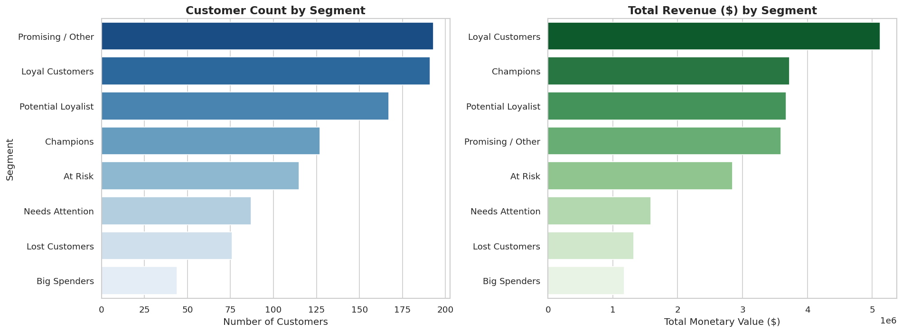
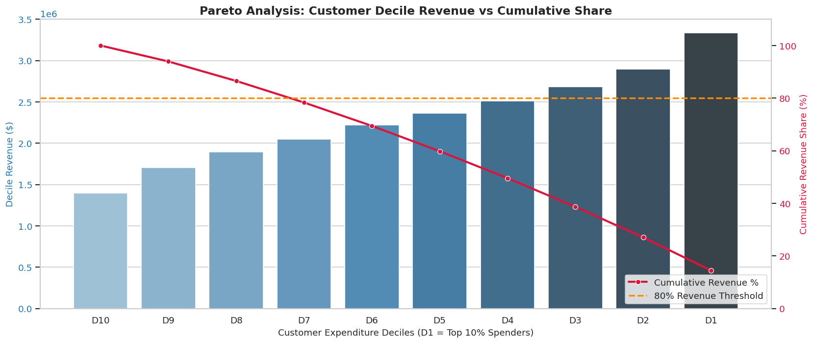

# 📊 Customer Segmentation & RFM Analytics Pipeline

[](https://www.python.org/)
[](https://pandas.pydata.org/)
[](https://seaborn.pydata.org/)
[](https://jupyter.org/)
[](https://opensource.org/licenses/MIT)

## 📌 Executive Overview
In modern e-commerce and retail ecosystems, uniform marketing strategies produce diminishing returns. This project delivers an end-to-end **Customer Segmentation & RFM (Recency, Frequency, Monetary) Analytics Pipeline** in Python. 

By analyzing **23,050 transactional records** across **1,000 unique customer accounts**, the framework classifies customers into 8 distinct behavioral cohorts, conducts rigorous **Pareto (80/20) revenue concentration modeling**, and formulates segment-specific retention and monetization strategies.

---

## 🎯 Business Objectives
1. **Behavioral Quantile Scoring**: Compute empirical Recency ($R$), Frequency ($F$), and Monetary ($M$) quintiles ($1 \to 5$) for every customer account.
2. **Actionable Customer Personas**: Map multi-dimensional RFM score permutations into intuitive business cohorts (e.g., *Champions*, *Loyal Customers*, *Potential Loyalist*, *At Risk*, *Lost Customers*).
3. **Revenue Concentration Analysis**: Perform decile-level Pareto analysis to quantify top-tier customer revenue dependency.
4. **Targeted Commercial Recommendations**: Design tailored marketing, upsell, loyalty, and reactivation workflows for each customer segment.

---

## 📁 Repository Structure

```text
python_project/
│
├── 📂 images/                                # High-resolution analytical plots & visualizations
│   ├── 🖼️ rfm_customer_segments.png          # Cohort volume and revenue distribution bar plots
│   └── 🖼️ pareto_decile_analysis.png         # Dual-axis Pareto cumulative revenue curve
├── 📓 Customer_Segmentation_Analysis.ipynb   # Fully executed end-to-end analytical notebook
├── 📄 Customer_Master_Data.xlsx              # Master customer profile records (Demographics, Join Date, City)
├── 📄 Customer_Master_Data.csv               # CSV export of customer master data
├── 📄 Customer_Transactions.csv              # 23,050 granular order transactions (Dates, Amounts)
└── 📄 README.md                              # Detailed project documentation
```

---

## 🧮 Methodology & Analytical Framework

### 1. RFM Metric Definitions
* **Recency ($R$)**: Days elapsed from the customer's last recorded purchase to the global reference date ($\max(\text{TransactionDate}) + 1\text{ day}$).
* **Frequency ($F$)**: Total number of completed transactions per customer.
* **Monetary ($M$)**: Total gross spending across all lifetime transactions.

### 2. Quintile Scoring Scheme
Using pandas `pd.qcut()`, each metric is divided into 5 equal-frequency bins and scored from 1 to 5:

$$\text{R-Score} \in \{5, 4, 3, 2, 1\} \quad (\text{Lower Recency Days} \implies \text{Score } 5)$$

$$\text{F-Score} \in \{1, 2, 3, 4, 5\} \quad (\text{Higher Transaction Count} \implies \text{Score } 5)$$

$$\text{M-Score} \in \{1, 2, 3, 4, 5\} \quad (\text{Higher Monetary Spend} \implies \text{Score } 5)$$

### 3. Cohort Mapping Rules

> **Evaluation Precedence**: Customer personas are assigned sequentially using an `if-elif` decision hierarchy (as ordered below). Earlier matching conditions take priority.

| Segment Name | Scoring Condition | Customer Profile |
| :--- | :--- | :--- |
| **🏆 Champions** | $R \ge 4 \land F \ge 4 \land M \ge 4$ | Bought recently, buy frequently, and spend the most. |
| **💎 Loyal Customers** | $R \ge 2 \land F \ge 4$ | Consistent repeat purchasers with dependable revenue. |
| **🌱 Potential Loyalist** | $R \ge 4 \land F \ge 2$ | Recent buyers with above-average purchase frequency. |
| **⭐ Big Spenders** | $M \ge 4 \land F \ge 2 \land R \ge 2$ | High-value buyers with larger average basket sizes. |
| **⚠️ At Risk** | $R \le 2 \land F \ge 3$ | Former frequent buyers who have not transacted recently. |
| **🔍 Needs Attention** | $R = 3$ | Moderate recency, frequency, and monetary metrics. |
| **🚪 Lost Customers** | $R = 1 \land F \le 2 \land M \le 2$ | Lowest engagement, long lapsed, minimal spend. |
| **📦 Promising / Other** | All remaining combinations | New or low-frequency customers requiring nurturing. |

---

## 📈 Key Empirical Findings & Results

```text
Total Transactions Analyzed:     23,050
Total Customer Accounts:          1,000
Total Cumulative Revenue:   $23,053,199.66
Average Customer Spend:        $23,053.20
Average Transaction Frequency:    23.05 orders
```

### Cohort Distribution Breakdown

| Segment Name | Customer Count | Customer Share (%) | Total Revenue (USD) | Revenue Share (%) | Avg Recency (Days) | Avg Frequency | Avg Spend (USD) |
| :--- | :---: | :---: | :---: | :---: | :---: | :---: | :---: |
| **Loyal Customers** | 191 | 19.1% | \$5,122,606.00 | **22.2%** | 39.4 | 27.7 | \$26,819.93 |
| **Champions** | 127 | 12.7% | \$3,725,144.54 | **16.2%** | 10.7 | 28.6 | \$29,331.85 |
| **Potential Loyalist** | 167 | 16.7% | \$3,674,855.18 | **15.9%** | 11.4 | 22.1 | \$22,005.12 |
| **Promising / Other** | 193 | 19.3% | \$3,595,291.91 | **15.6%** | 52.5 | 18.1 | \$18,628.46 |
| **At Risk** | 115 | 11.5% | \$2,845,842.87 | **12.3%** | 118.4 | 25.4 | \$24,746.46 |
| **Needs Attention** | 87 | 8.7% | \$1,587,563.27 | **6.9%** | 33.5 | 18.9 | \$18,247.85 |
| **Lost Customers** | 76 | 7.6% | \$1,323,163.04 | **5.7%** | 148.4 | 18.1 | \$17,410.04 |
| **Big Spenders** | 44 | 4.4% | \$1,178,732.85 | **5.1%** | 47.0 | 22.9 | \$26,789.38 |



---

### 📊 Pareto Analysis (80/20 Decile Revenue Distribution)

| Decile | Customer Tier | Decile Spend (USD) | Cumulative Revenue (USD) | Cumulative Share (%) |
| :---: | :--- | :---: | :---: | :---: |
| **D1** | Top 10% Spenders | \$3,333,443.49 | \$3,333,443.49 | 14.5% |
| **D2** | Top 10%–20% | \$2,897,719.86 | \$6,231,163.35 | 27.0% |
| **D3** | Top 20%–30% | \$2,680,961.56 | \$8,912,124.91 | 38.7% |
| **D4** | Top 30%–40% | \$2,511,399.27 | \$11,423,524.18 | 49.6% |
| **D5** | Top 40%–50% | \$2,362,436.64 | \$13,785,960.82 | 59.8% |
| **D6** | Top 50%–60% | \$2,219,432.09 | \$16,005,392.91 | 69.4% |
| **D7** | Top 60%–70% | \$2,050,055.16 | \$18,055,448.07 | 78.3% |
| **D8** | Top 70%–80% | \$1,891,709.36 | \$19,947,157.43 | 86.5% |
| **D9** | Top 80%–90% | \$1,707,605.30 | \$21,654,762.73 | 93.9% |
| **D10** | Bottom 10% Spenders | \$1,398,436.93 | \$23,053,199.66 | 100.0% |

#### Key Pareto Observations:
- **Top 20% of spenders (Deciles D1–D2)** generate **\$6,231,163.35** (27.0% of total portfolio revenue).
- **Top 50% of spenders (Deciles D1–D5)** generate **\$13,785,960.82** (59.8% of total portfolio revenue).
- **Top 70% of spenders (Deciles D1–D7)** achieve **78.3% cumulative revenue share**, highlighting strong baseline customer lifetime values and broad spending consistency across accounts.



---

## 💡 Strategic Marketing Recommendations

1. **VIP Loyalty & Advocacy (Champions)**:
   - Enroll in exclusive early-access perks, referral incentives, and priority concierge support.
2. **Basket Size Optimization (Loyal Customers)**:
   - Implement cross-category bundle discounts and personalized up-sell recommendations.
3. **Churn Prevention & Re-engagement (At Risk)**:
   - Deploy automated win-back email sequences with time-sensitive discount triggers for customers exceeding 90 days of inactivity.
4. **Onboarding Acceleration (Potential Loyalist)**:
   - Deliver gamified second-purchase rewards within 14 days of initial transaction.

---

## 🚀 Getting Started & Execution

```bash
# Clone the repository
git clone https://github.com/ktkartik1234-lgtm/Data-Analytics-Portfolio.git

# Navigate to the Python project directory
cd python_project

# Install dependencies
pip install pandas numpy matplotlib seaborn openpyxl

# Launch Jupyter Notebook
jupyter notebook Customer_Segmentation_Analysis.ipynb
```

---

## 👤 Author & Contact
* **Kartik Tripathi**
* **LinkedIn**: [linkedin.com/in/kartik-tripathi-725697383](https://www.linkedin.com/in/kartik-tripathi-725697383)
* **GitHub**: [github.com/ktkartik1234-lgtm](https://github.com/ktkartik1234-lgtm)
* **Email**: [ktkartik1234@gmail.com](mailto:ktkartik1234@gmail.com)
